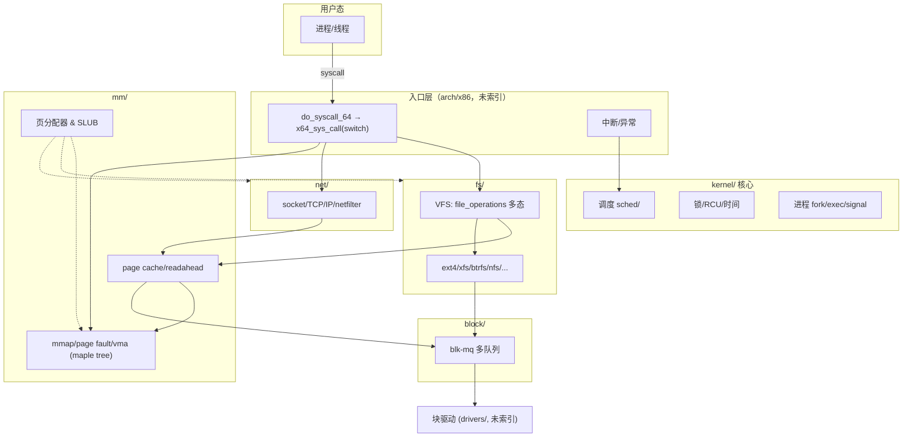
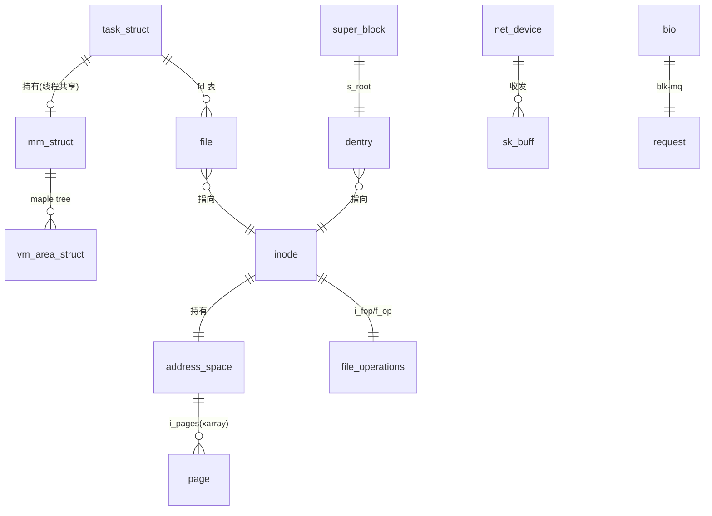
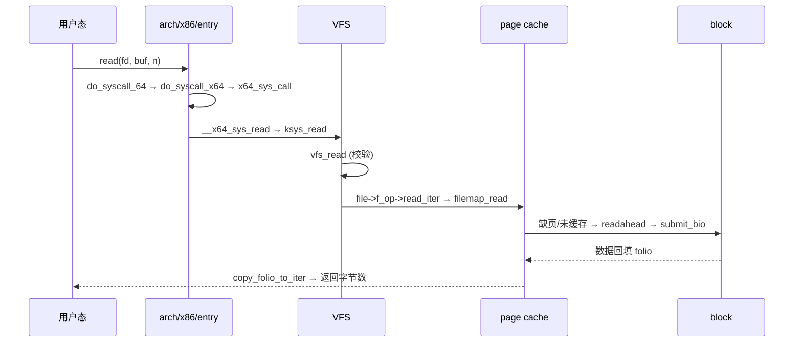

# Linux Kernel 7.2.3 代码级技术架构报告

> 按《代码搜索最佳实践》(`code_search_best_practices.md`) 执行。
> 结论标注：**[verified]** = 实跑/观测；**[static]** = 静态（源码阅读 + code search 结果）。
> 索引：`/opt/code_caches/linux_723_cache`（693,026 chunks，排除 drivers/sound/arch/rust/tools 等）。
> 源码：`/opt/linux/src/linux-7.2.3`。探索路径：无具体问题 → 默认「整体架构 → 子模块」。

## 1. Scope & purpose

- **Purpose**：默认路径。建立 7.2.3 内核的**代码级**技术架构：子系统划分、分层、核心数据结构、以及五条关键执行路径的精确调用链。
- **Environment**：**[static]** 未运行内核（无本地可启动 target）。验证 = 源码阅读 + 语义搜索 + 调用图 + 数据流。
- **索引覆盖（`$ACS check` + 统计）**：13,072 文件 → 693,026 chunks；向量/HNSW/call_graph/dataflow/word_freq 齐全；KV 已导入 `/code/linux_723`。
- **注意**：本索引**排除了 `arch/`**，故系统调用入口等架构代码只能读源码，不能语义搜索。`drivers/`、`sound/`、`rust/` 亦排除。
- **Out of scope**：具体文件系统实现（ext4/btrfs/xfs…）内部、具体驱动、架构汇编细节。

## 2. Architecture overview（横向，按 chunk 量化）  [static]

| 子系统 | chunks | 层级 / 角色 |
|---|---:|---|
| `include/` | 433,949 | 横切：全内核数据结构与接口定义 |
| `fs/` | 98,299 | 功能域：VFS + 各文件系统 |
| `net/` | 75,600 | 功能域：协议栈（socket/TCP/IP/netfilter…） |
| `kernel/` | 34,311 | 核心：调度、锁、时间、RCU、进程/信号 |
| `lib/` | 14,016 | 通用库（rbtree/maple tree/bitmap/atomic） |
| `mm/` | 12,839 | 功能域：虚拟内存、页分配、page cache、回收 |
| `security/` | 10,503 | LSM / SELinux / capability |
| `crypto/` | 4,719 | 加密算法与 API |
| `block/` | 4,664 | 块层：bio、blk-mq 多队列 |
| `io_uring/` | 2,165 | 现代异步 IO |
| `ipc/` `init/` `virt/` | 648/490/683 | 进程间通信 / 启动 / 虚拟化 |

**分层读法**：`入口(arch)` → `kernel 核心` → `mm/fs/net 三大功能域` → `block` → `drivers`。
`include/` 横切；`lib/`（如 maple tree、rbtree）被各层复用。

## 3. Core data structures & relationships（linux-7.2.3 行号）  [static]

| 结构 | 定义 | 角色 | 关系 |
|---|---|---|---|
| `task_struct` | `include/linux/sched.h:826` | 进程/线程描述符 | 持有 `mm`、`files_struct`、`signal_struct`；调度实体 `sched_entity`；`sched_class` 挂 `rq` |
| `mm_struct` | `include/linux/mm_types.h:1160` | 地址空间 | 持有 maple tree（VMA）、页表根 `pgd`；线程共享 |
| `vm_area_struct` | `include/linux/mm_types.h:920` | 虚拟内存区间 | 挂在 `mm_struct` 的 maple tree；带 `vm_ops` 多态 |
| `address_space` | `include/linux/fs.h:472` | 页缓存宿主 | 由 `inode` 持有；`i_pages`（xarray）索引 page |
| `inode` | `include/linux/fs.h:762` | 文件元数据对象 | 被 `dentry` 引用；含 `i_fop`（file_operations） |
| `struct file` | `include/linux/fs.h:1255` | 打开的文件描述 | 指向 `inode` + `f_op`；fd 表项 |
| `super_block` | `include/linux/fs/super_types.h:132` | 已挂载文件系统实例 | 持有 `s_root`(dentry)、`s_op` |
| `dentry` | `include/linux/dcache.h:93` | 目录项缓存 | 指向 `inode`，构成路径解析结果 |
| `file_operations` | `include/linux/fs.h:1921` | 文件操作函数表 | VFS 多态的核心（`read_iter`/`write_iter`/`mmap`…） |
| `sk_buff` | `include/linux/skbuff.h:886` | 网络数据包 | 协议栈各层间传递 |
| `net_device` | `include/linux/netdevice.h:2149` | 网络设备 | 收发入口（`ndo_start_xmit`） |
| `bio` | `include/linux/blk_types.h:210` | 块 IO 请求 | 描述一段块设备 IO |
| `request` | `include/linux/blk-mq.h:105` | blk-mq 请求 | 多队列调度单位 |

> 架构含义：**"一切皆文件"由 `file_operations`(vtable) 实现**——VFS 只调 `f_op->read_iter`，各 FS/设备多态实现，是读 `fs/` 的钥匙。
> 内核 5.x 后 `vm_area_struct` 改挂 **maple tree**（`mm_struct` 内），取代红黑树，支持无锁读与区间查询。

## 4. Vertical analysis：五条关键路径（代码级）

### 4.1 系统调用 `read(2)`：入口 → VFS → page cache → 块层  [static]

**代码级调用链**：
- `do_syscall_64`（`arch/x86/entry/syscall_64.c:87`）→ `do_syscall_x64`（`:52`）→ `x64_sys_call`（`:35`，**`switch` 分发**）
- `SYSCALL_DEFINE3(read,…)` → `ksys_read`（`fs/read_write.c:705`）→ `vfs_read`（`:554`）
- `vfs_read` 校验 `f_mode`/`access_ok`/`rw_verify_area` 后：`file->f_op->read` 或 `new_sync_read`（走 `read_iter`）
- 通用文件走 `filemap_read`（`mm/filemap.c:2783`）→ `filemap_get_pages()` 取/回填 folio → `copy_folio_to_iter()`
- 回填未命中 → `readahead` → `address_space` → 最终 `submit_bio`（`block/blk-core.c:952`）→ `submit_bio_noacct` → `blk_mq_submit_bio`（`block/blk-mq.c:3093`）

### 4.2 调度：`__schedule` 上下文切换  [static]

`__schedule`（`kernel/sched/core.c:7061`）关键步骤（源码顺序）：
1. `prev = rq->curr`；`rcu_note_context_switch()`；`rq_lock()`
2. `next = pick_next_task(rq, &rf)` —— 由调度类 `sched_class`（fair/rt/deadline）多态选出
3. `context_switch(rq, prev, next, &rf)` —— 切换地址空间（`switch_mm`）+ 寄存器/栈（`switch_to`）
4. `finish_task_switch` 收尾（释放前任务的锁、`mm` 引用等）

涉及结构：`task_struct.sched_entity`、`rq`（per-CPU 运行队列）、`sched_class` 函数表（与 `file_operations` 同型的多态设计）。

### 4.3 缺页异常 `handle_mm_fault`  [static]

`handle_mm_fault`（`mm/memory.c:6651`）→ `__handle_mm_fault`：按 `pgd→p4d→pud→pmd→pte` 逐级向下，缺则 `p4d_alloc/pud_alloc/pmd_alloc` 分配页表；到 PTE 后 `handle_pte_fault` 分派：
- `do_anonymous_page`（匿名页，直接分配）
- `do_fault`（文件页，走 `vm_ops->fault` → `filemap_fault` → page cache）
- `do_swap_page`（换入）、`do_wp_page`（写时复制）

核心结构：`mm_struct`（地址空间）、`vm_area_struct`（区间/`vm_ops`）、`folio`/`page`。

### 4.4 网络接收：从网卡到 TCP  [static]

`netif_receive_skb`（`net/core/dev.c:6468`）→ `__netif_receive_skb`/`deliver_skb` → 按 `skb->protocol` 分发 → `ip_rcv`（`net/ipv4/ip_input.c:603`）→ `ip_rcv_finish` → `ip_local_deliver` → `tcp_v4_rcv`（`net/ipv4/tcp_ipv4.c:2070`）→ 套接字接收队列。
核心结构：`sk_buff`（贯穿各层的包描述符）、`net_device`（收发）、`socket`/`sock`。

### 4.5 块 IO 提交  [static]

`submit_bio`（`block/blk-core.c:952`，记账 + `bio_set_ioprio`）→ `submit_bio_noacct` → `blk_mq_submit_bio`（`block/blk-mq.c:3093`）→ 生成 `request` → 硬件队列 → 驱动。
核心结构：`bio`（IO 描述）、`request`（blk-mq 调度单位）、`request_queue`（多队列 + 调度器）。

## 5. Black boxes（有意不展开）

| 接口 | 作用 | 为何不开 |
|---|---|---|
| `file_operations->read_iter` 各实现 | ext4/xfs/btrfs 读 | 支线，按需再进 |
| `vm_ops->fault` 各实现 | 文件映射缺页 | 支线 |
| `sched_class`（fair/rt/dl） | 调度算法 | 只记接口 |
| `ndo_start_xmit`（drivers 未索引） | 网卡发送 | 驱动范围外 |
| `block` 各 IO 调度器（mq-deadline/bfq） | 请求排序 | 支线 |
| `crypto/`、`security/`（LSM） | 加密/访问控制 | 与主链正交 |

## 6. Design commentary & open questions  [static]

- **系统调用分发已是 `switch` 而非跳转表**：`sys_call_table[]` 注释明说 *“no longer used for system calls”*，
  实际 `x64_sys_call()` 用 `switch` 分发并配 `array_index_nospec()` —— **Spectre 缓解**，避免数据相关间接跳转。
- **fd 生命周期用 cleanup（类 RAII）**：`ksys_read` 里 `CLASS(fd_pos, f)(fd)` 自动 `fget`/`fput`，减少引用计数 bug。
- **VFS/调度/sc_ops 处处是"函数表多态"**：`file_operations`、`sched_class`、`super_operations` —— 内核用统一模式解耦抽象与实现。
- **`vm_area_struct` 改挂 maple tree**：无锁读、区间查询更优，取代旧的红黑树。
- **`io_uring`（2,165 chunks）** 是近年最重要的异步 IO 抽象，值得单独开黑盒。
- **我会怎么改/工具改进**见 §8。

## 7. Follow-ups

- [ ] 打开 `filemap_read`/`readahead` 黑盒（page cache 预读算法）。
- [ ] 读 `io_uring` 的 SQ/CQ ring 与 `io_kiocb` 生命周期。
- [ ] `sched_ext`（BPF 可编程调度器）是否在 7.2.3 存在、如何接入 `sched_class`。
- [ ] RCU：`call_rcu`（`kernel/rcu/tree.c:3277`）→ 宽限期机制。
- [ ] 重建 `arch/` 索引以覆盖系统调用入口/中断（当前排除）。

## 8. 本次暴露的工具问题（已修/待修）

**已修复（本次）** —— `cache_import` 从 **4 小时卡死 → 14.8 秒**完成 693k chunks：
1. `src/cache/tag_index.c`：删除每次插入对公共 tag 的 **O(n) 去重扫描**。
2. `src/cache/tag_index.c`：tag hash 表**动态扩容**（原固定 64 bucket，唯一 tag 一多退化为链表 → O(n²)）。
3. `src/cache/namespace.c`：修 **`find_or_create_child` 去重比较 bug**（用完整路径比单分量，永不命中 → 每个 key 新建节点、namespace 树爆炸），并改**排序 + 二分**。

**待修（本次发现）**：
4. `cache_import` **不导入 `/symbols/` 索引** → `context`/`symbol` 查询恒空（文档宣称的能力回归）。
5. `call_graph` 的 fan-in 被 **ioctl/setsockopt 等巨型 switch 函数**主导（`btrfs_ioctl`/`sctp_getsockopt`/`do_swap_page`），
   作"中心性"指标噪声大，判核心应结合目录与语义搜索。
6. `count > MAX_VARS(10000)`：dataflow 只覆盖前 1 万变量（内核远超）。

### 附：方法论执行自评

| 阶段 | 执行 | 证据 |
|---|---|---|
| 1 跑起来 | ❌降级 | 无可跑内核；已明示 |
| 2 明确目的 | ✅ | 默认整体架构→子模块 |
| 3 主线/支线 | ✅ | 5 条主线；6 个黑盒 |
| 4 纵横 | ✅ | 横向子系统图；纵向 5 条调用链 |
| 5 情景分析 | ❌降级 | 静态源码阅读 |
| 6 测试用例 | ❌ | 超范围 |
| 7 数据结构 | ✅ | 12 个核心结构 + maple tree/多态关系 |
| 8 主动提问 | ✅ | Spectre switch、RAII、工具 6 问题 |
| 9 报告 | ✅ | 本文件 |
