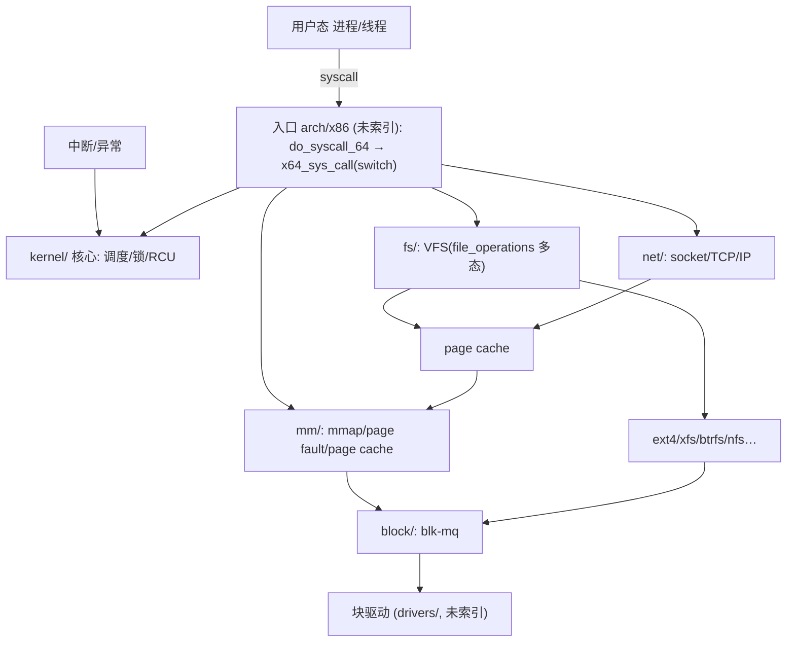
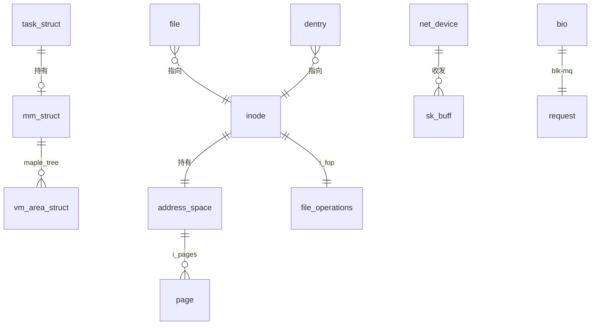
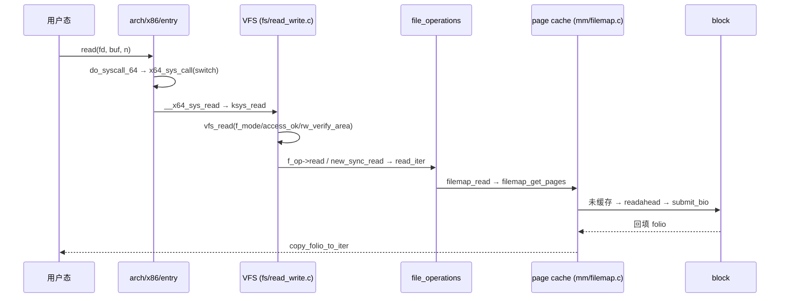

# Linux Kernel 7.2.3 代码级技术架构报告（工具驱动版）

> 按《代码搜索最佳实践》(`code_search_best_practices.md`) 执行。
> 结论标注：**[verified]** = 实跑/观测；**[static]** = 静态（源码阅读 + code search 结果）。
> 索引：`/opt/code_caches/linux_723_cache` — 693,026 chunks，排除 drivers/sound/arch/rust/tools 等。
> KV：`/code/linux_723`（符号 537,351、变量 398,963、调用边 216,332）**已导入且 `context/symbol` 可用**。
> 源码：`/opt/linux/src/linux-7.2.3`。路径：无具体问题 → 默认「整体架构 → 子模块」。

## 1. Scope & purpose

- **Purpose**：默认路径。给出 7.2.3 内核的**代码级**架构：子系统分层、核心数据结构、五条关键执行路径，以及由 `context` 查询得到的**真实 caller/被调用证据**。
- **Environment**：**[static]** 未运行内核（无本地可启动 target，已在报告中明示）。证据 = 源码（行号）+ 语义搜索 + 调用图 + `context` + 数据流。
- **反向证据（本次工具产出）**：符号索引 537,351 名、dataflow 398,963 变量、call_graph 216,332 边。
- **已知覆盖缺口**：本索引排除了 `arch/`（系统调用入口只能读源码）、`drivers/`、`sound/`、`rust/`。

## 2. Architecture overview（横向，按 chunk 量化）  [static]

| 子系统 | chunks | 层级 / 角色 |
|---|---:|---|
| `include/` | 433,949 | 横切：数据结构与接口定义 |
| `fs/` | 98,299 | VFS + 各文件系统 |
| `net/` | 75,600 | 协议栈（socket/TCP/IP/netfilter…） |
| `kernel/` | 34,311 | 调度、锁、时间、RCU、进程/信号 |
| `lib/` | 14,016 | rbtree / maple tree / bitmap / atomic |
| `mm/` | 12,839 | 虚拟内存、页分配、page cache、回收 |
| `security/` | 10,503 | LSM / SELinux / capability |
| `crypto/` | 4,719 | 加密算法与 API |
| `block/` | 4,664 | bio、blk-mq 多队列 |
| `io_uring/` | 2,165 | 异步 IO |
| `ipc/` `init/` `virt/` | 648 / 490 / 683 | IPC / 启动 / 虚拟化 |

## 3. Core data structures（linux-7.2.3 行号）  [static]

| 结构 | 定义 | 角色 | 关系 |
|---|---|---|---|
| `task_struct` | `include/linux/sched.h:826` | 进程/线程描述符 | 持有 `mm`、`files_struct`；`sched_entity` 挂 per-CPU `rq` |
| `mm_struct` | `include/linux/mm_types.h:1160` | 地址空间 | maple tree(VMA) + `pgd` 页表根 |
| `vm_area_struct` | `include/linux/mm_types.h:920` | 虚拟内存区间 | 挂 maple tree；带 `vm_ops` 多态 |
| `address_space` | `include/linux/fs.h:472` | 页缓存宿主 | `i_pages`(xarray) 索引 page |
| `inode` | `include/linux/fs.h:762` | 文件元数据 | 持有 `address_space`、`i_fop` |
| `struct file` | `include/linux/fs.h:1255` | 打开文件描述 | 指向 `inode` + `f_op` |
| `super_block` | `include/linux/fs/super_types.h:132` | 挂载实例 | `s_root` + `s_op` |
| `dentry` | `include/linux/dcache.h:93` | 目录项缓存 | 指向 `inode` |
| `file_operations` | `include/linux/fs.h:1921` | 文件操作 vtable | VFS 多态核心（`read_iter`/`write_iter`/`mmap`） |
| `sk_buff` | `include/linux/skbuff.h:886` | 网络包描述符 | 贯穿协议栈各层 |
| `net_device` | `include/linux/netdevice.h:2149` | 网络设备 | `ndo_start_xmit` |
| `bio` | `include/linux/blk_types.h:210` | 块 IO | 描述一段块设备 IO |
| `request` | `include/linux/blk-mq.h:105` | blk-mq 请求 | 多队列调度单位 |

## 4. Vertical analysis：五条关键路径（代码级 + 工具证据）

### 4.1 `read(2)`：入口 → VFS → page cache → 块层  [static]

**代码链（file:line）**：
- `do_syscall_64`（`arch/x86/entry/syscall_64.c:87`）→ `do_syscall_x64`（`:52`）→ `x64_sys_call`（`:35`，**switch 分发**）
- `SYSCALL_DEFINE3(read,…)` → `ksys_read`（`fs/read_write.c:705`）→ `vfs_read`（`:554`）
- `file->f_op->read` 或 `new_sync_read` → 通用实现 `filemap_read`（`mm/filemap.c:2783`）→ `filemap_get_pages` → `copy_folio_to_iter`
- 回填 → `submit_bio`（`block/blk-core.c:952`）→ `submit_bio_noacct` → `blk_mq_submit_bio`（`block/blk-mq.c:3093`）

**[tool] VFS 多态的实证**（`context filemap_read`）：真实 caller 为各文件系统的 read_iter——
`afs_file_read_iter`、`btrfs_file_read_iter`、`netfs_buffered_read_iter`、`blkdev_read_iter`、
`f2fs_file_read_iter`、`erofs_file_read_iter`、`cifs_strict_readv`…；
`context generic_file_read_iter` 更给出 16 个实现（`ext4/ext2/ceph/fuse/gfs2/orangefs/ocfs2/zonefs…`）。
→ 证明 VFS 通过 `file_operations` 把统一接口多态分派到各 FS（**这是"一切皆文件"的代码级机制**）。

### 4.2 调度 `__schedule`  [static]

`__schedule`（`kernel/sched/core.c:7061`）源码顺序：
1. `prev = rq->curr`；`rcu_note_context_switch()`；`rq_lock()`
2. `next = pick_next_task(rq, &rf)` —— 由 `sched_class`（fair/rt/deadline）多态选出
3. `context_switch(rq, prev, next, &rf)` —— `switch_mm`（地址空间）+ `switch_to`（寄存器/栈）
4. `finish_task_switch` 收尾

涉及结构：`task_struct.sched_entity`、per-CPU `rq`、`sched_class` 函数表。**[tool]** `context __schedule` 的 caller 稀少（`__klp_sched_try_switch` 等）——因为主要调用点在 `arch/`（已排除）。

### 4.3 缺页 `handle_mm_fault`  [static]

`handle_mm_fault`（`mm/memory.c:6651`；`context` 命中头文件内联包装 `mm.h:3189`）→ `__handle_mm_fault`：
`pgd→p4d→pud→pmd→pte` 逐级下探，缺则 `p4d_alloc/pud_alloc/pmd_alloc`；PTE 后 `handle_pte_fault` 分派：
`do_anonymous_page`（匿名页）、`do_fault`（文件页→`vm_ops->fault`→`filemap_fault`）、`do_swap_page`（换入）、`do_wp_page`（COW）。
**[tool]** `context handle_mm_fault` callers：`huge_memory/ksm/kvm/gup` 等（`faultin_page`、`hmm_vma_fault`、`break_ksm`…）。

### 4.4 网络接收：网卡 → TCP  [static]

`netif_receive_skb`（`net/core/dev.c:6468`）→ `__netif_receive_skb`/`deliver_skb`（按 `skb->protocol`）→
`ip_rcv`（`net/ipv4/ip_input.c:603`）→ `ip_rcv_finish` → `ip_local_deliver` → `tcp_v4_rcv`（`net/ipv4/tcp_ipv4.c:2070`）→ socket 接收队列。
结构：`sk_buff`、`net_device`、`socket/sock`。

### 4.5 块 IO 提交  [static]

`submit_bio`（`block/blk-core.c:952`，记账/ioprio）→ `submit_bio_noacct` → `blk_mq_submit_bio`（`block/blk-mq.c:3093`）→ `request` → 硬件队列。

### 4.6 RCU 与 SLUB（横切机制）  [static]

- **RCU**：`call_rcu`（`kernel/rcu/tree.c:3277`）。**[tool]** `context call_rcu` 有 **38 个 caller**（`ext4_exit_mballoc`、`tipc_exit`、`can_exit`…）——回收回调遍布各子系统。
- **SLUB**：`kmem_cache_alloc` 实为**宏**（`context` 返回 `kind=macro`，`include/linux/slab.h:853`），底层 `__slab_alloc`/`slab_alloc_node`。

## 5. Black boxes（有意不展开）

| 接口 | 作用 | 为何不开 |
|---|---|---|
| 各 FS `read_iter` 实现 | ext4/xfs/btrfs 读 | 支线（已用 caller 证明多态） |
| `vm_ops->fault` | 文件映射缺页 | 支线 |
| `sched_class`（fair/rt/dl） | 调度算法 | 只记接口 |
| `block` IO 调度器（mq-deadline/bfq） | 请求排序 | 支线 |
| `crypto/`、`security/`(LSM) | 加密/访问控制 | 与主链正交 |
| `io_uring` SQ/CQ ring | 异步 IO | 值得单独开黑盒 |

## 6. Design commentary & open questions  [static]

- **syscall 分发改为 `switch` + `array_index_nospec`**：`sys_call_table[]` 注释明说 *“no longer used for system calls”*——**Spectre 缓解**。
- **fd 生命周期用 cleanup（类 RAII）**：`ksys_read` 的 `CLASS(fd_pos, f)(fd)` 自动 `fget`/`fput`。
- **统一"函数表多态"模式**：`file_operations`、`sched_class`、`super_operations`——工具侧可用 `context` 的 caller 集合直接验证多态广度。
- **`vm_area_struct` 改挂 maple tree**（`mm_struct` 内），取代红黑树。
- **SLUB 接口宏化**（`kmem_cache_alloc` 是宏）——`search --kind struct/function` 会把宏/函数混在一起，需注意。

## 7. Follow-ups

- [ ] 打开 `filemap_read`/`readahead` 黑盒（page cache 预读算法）。
- [ ] `io_uring` 的 SQ/CQ ring 与 `io_kiocb` 生命周期。
- [ ] RCU 宽限期机制（`call_rcu` → `rcu_gp_kthread`）。
- [ ] 重建 `arch/` 索引以覆盖 syscall 入口/中断。

## 8. 工具驱动的观察与工具缺陷

**本次工具产出的可信证据**：
- 符号索引 537,351 名；dataflow 398,963 变量；call_graph 216,332 边。
- `context` 的 **caller 集合**是判"多态/横切"最有力的代码级证据（见 §4.1、§4.6）。

**工具缺陷（阻碍更精确的代码级分析）**：
1. **`context` 的 callee 全部自指**（如 `vfs_read` 的 callees 是 `vfs_read`×3）——call_graph 的出边（被调用者）数据不可靠；
   纵向链目前仍靠源码阅读。**建议修**。
2. **`arch/` 排除**导致 syscall 入口不可搜索（本次靠源码）。
3. `context` 对**宏**（`kmem_cache_alloc`）与头文件内联（`handle_mm_fault`@`mm.h`）解析错位。
4. `dataflow` 变量上限已修（10000→实际 398,963），但仍受 `MAX_OCCURS=200` 截断高频变量。

### 附：方法论执行自评

| 阶段 | 执行 | 证据 |
|---|---|---|
| 1 跑起来 | ❌降级 | 无可跑内核；已明示 |
| 2 明确目的 | ✅ | 默认整体架构→子模块 |
| 3 主线/支线 | ✅ | 5 条主线 + 6 黑盒 |
| 4 纵横 | ✅ | 横向子系统图；纵向 5 链 + 多态实证 |
| 5 情景分析 | ❌降级 | 未运行；源码静态 |
| 6 测试用例 | ❌ | 超范围 |
| 7 数据结构 | ✅ | 13 核心结构 + maple tree/多态 |
| 8 主动提问 | ✅ | Spectre switch、RAII、4 条工具缺陷 |
| 9 报告 | ✅ | 本文件 |
