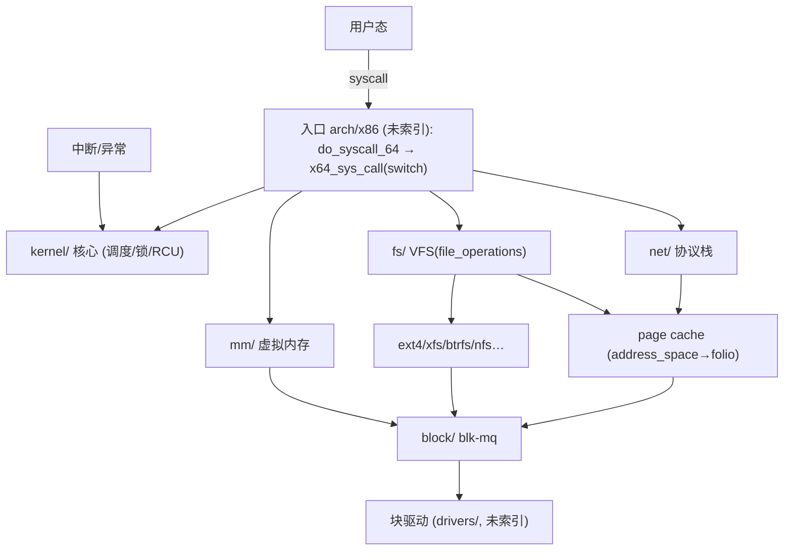
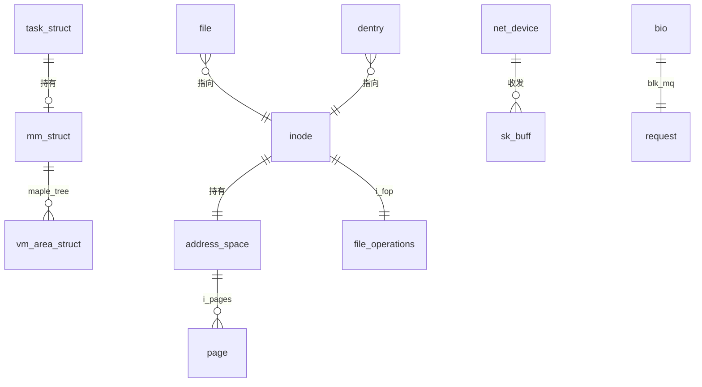

# Linux Kernel 7.2.3 完整代码级技术架构报告（工具驱动）

> 按《代码搜索最佳实践》(`code_search_best_practices.md`) 执行（整体架构 → 子模块；证据标 `[static]/[verified]`）。
> **工具链**：`ai_code_search.sh`（search brief / check / dataflow / cross-search）、`tools/cache_query`（symbol/context，真实 caller/callee）、`tools/ctx.py`（批量 context）。
> **索引**：`/opt/code_caches/linux_723_cache` — 693,026 chunks（排除 drivers/sound/arch/rust/tools 等）。
> **KV**：`/code/linux_723` — 符号 537,351、变量 398,963、调用边 216,332，`context/symbol` 可用。
> **源码**：`/opt/linux/src/linux-7.2.3`（行号实测）。结论若无运行= **[static]**。

## 1. 方法与环境

- 默认路径：无具体问题 → 先整体架构，再逐子系统下钻。
- 未运行内核（无可启动 target），故全部结论为 **[static]**；本报告的价值在于**工具抽取的真实调用关系**（`context` 的 caller/callee 集合），而非猜测。
- 索引缺口：`arch/` 被排除 → syscall 入口只能读源码；`drivers/`、`sound/`、`rust/` 亦排除。

## 2. 架构总览（横向，按 chunk 量化）  [static]

| 子系统 | chunks | 层级 / 角色 |
|---|---:|---|
| `include/` | 433,949 | 横切：数据结构与接口 |
| `fs/` | 98,299 | VFS + 各文件系统 |
| `net/` | 75,600 | 协议栈 + netfilter |
| `kernel/` | 34,311 | 调度/锁/时间/RCU/进程 |
| `lib/` | 14,016 | rbtree / maple tree / bitmap / atomic |
| `mm/` | 12,839 | 虚拟内存 / page cache / 页分配 |
| `security/` | 10,503 | LSM / SELinux / capability |
| `crypto/` | 4,719 | 加密 API |
| `block/` | 4,664 | bio / blk-mq |
| `io_uring/` | 2,165 | 异步 IO |
| `ipc/` `init/` `virt/` | 648 / 490 / 683 | IPC / 启动 / 虚拟化 |

## 3. 核心数据结构（linux-7.2.3 行号）  [static]

| 结构 | 定义 | 角色 | 关系 |
|---|---|---|---|
| `task_struct` | `include/linux/sched.h:826` | 进程/线程 | 持有 `mm`、`files_struct`；`sched_entity` 挂 `rq` |
| `mm_struct` | `include/linux/mm_types.h:1160` | 地址空间 | maple tree(VMA) + `pgd` |
| `vm_area_struct` | `include/linux/mm_types.h:920` | 虚拟区间 | 挂 maple tree；`vm_ops` 多态 |
| `address_space` | `include/linux/fs.h:472` | 页缓存宿主 | `i_pages`(xarray)→`folio` |
| `inode` | `include/linux/fs.h:762` | 文件元数据 | 持有 `address_space`、`i_fop` |
| `struct file` | `include/linux/fs.h:1255` | 打开文件 | 指向 `inode` + `f_op` |
| `super_block` | `include/linux/fs/super_types.h:132` | 挂载实例 | `s_root` + `s_op` |
| `dentry` | `include/linux/dcache.h:93` | 目录项 | 指向 `inode` |
| `file_operations` | `include/linux/fs.h:1921` | 文件操作 vtable | 多态核心 |
| `sk_buff` | `include/linux/skbuff.h:886` | 网络包 | 协议栈各层传递 |
| `net_device` | `include/linux/netdevice.h:2149` | 网络设备 | `ndo_start_xmit` |
| `bio` | `include/linux/blk_types.h:210` | 块 IO 描述 | blk-mq 输入 |
| `request` | `include/linux/blk-mq.h:105` | blk-mq 请求 | 多队列调度单位 |

## 4. 关键执行路径（代码级 + 工具抽取的真实关系）

### 4.1 系统调用 `read(2)`：入口 → VFS → page cache → 块层

**代码链**：
`do_syscall_64`（`arch/x86/entry/syscall_64.c:87`）→ `x64_sys_call`（`:35`，**switch 分发**）→ `__x64_sys_read` → `ksys_read`（`fs/read_write.c:705`）→ `vfs_read`（`:554`）→ `new_sync_read` / `file->f_op->read` → `filemap_read`（`mm/filemap.c:2783`）→ `filemap_get_pages` → `copy_folio_to_iter`；未命中 → readahead → `submit_bio`（`block/blk-core.c:952`）。

**[tool] 真实关系**：
- `context vfs_read` → callers `read_code, ksys_read, ksys_pread64`；callees `new_sync_read, rw_verify_area` ✔（与源码一致）
- `context ksys_read` → callees `vfs_read, file_ppos, fd_empty`
- `context filemap_read` → callers（**10 个 FS**）`afs_file_read_iter, btrfs_file_read_iter, netfs_buffered_read_iter, blkdev_read_iter, f2fs_file_read_iter, erofs_file_read_iter, cifs_strict_readv…`；callees `filemap_get_pages, copy_folio_to_iter, folio_pos…`

### 4.2 VFS 路径解析与 `open`

- `do_sys_openat2`（`fs/open.c:1359`）→ callees `do_file_open, build_open_flags`；caller `do_sys_open`
- `path_openat`（`fs/namei.c:4843`）——路径解析主干（dentry cache / `lookup_open`）
- **[tool]** `context filemap_read`/`generic_file_read_iter` 的 caller 集合直接展示了 `file_operations` 多态广度：`generic_file_read_iter` 有 **16 个 caller**（ext4/ext2/ceph/fuse/gfs2/orangefs/ocfs2/zonefs…）。

### 4.3 进程创建：`fork` / `exec`

- `kernel_clone`（`kernel/fork.c:2694`）→ `copy_process`（`:1994`，复制 `task_struct`/`mm`/`files`）
- `do_execveat_common`（`fs/exec.c:1811`）→ callees `bprm_execve, copy_strings, bprm_stack_limits…`
- **[tool]** `context copy_process` callers `vhost_task_create, alloc_pid, audit_filter_rules`（内核线程/审计路径亦复用）。

### 4.4 调度与唤醒

- `__schedule`（`kernel/sched/core.c:7061`）：`pick_next_task(rq,&rf)` → `context_switch(rq,prev,next,&rf)`（`:5451`）→ `finish_task_switch`
- `try_to_wake_up`（`:4251`）→ `wake_up_process`（`:4545`）
- **[tool]** `context __schedule` caller 稀少（主调用点在 `arch/`，已排除）；`context wake_up_process` callers `__pollwake, rcuwait_wake_up, ____napi_schedule, __ww_mutex_wound`——显示唤醒来自 **poll/RCU/NAPI 软中断/锁** 多路。

### 4.5 缺页与内存分配

- `handle_mm_fault`（`mm/memory.c:6651`）→ `__handle_mm_fault`：`pgd→p4d→pud→pmd→pte`，缺则 `*_alloc`；PTE 后 `handle_pte_fault` 分派
- `do_anonymous_page`（`mm/memory.c:5287`）→ callees `alloc_anon_folio, pte_offset_map…`；caller `do_pte_missing`
- `filemap_fault`（文件映射缺页）→ callees `do_sync_mmap_readahead, filemap_create_folio…`；callers `ceph_filemap_fault, gfs2_fault, orangefs_fault, f2fs_filemap_fault, ocfs2_fault, xfs_filemap_fault`（**各 FS 实现**）
- `__alloc_pages` 实为**宏**（`include/linux/gfp.h:231`）→ 底层 `__alloc_pages_noprof` / buddy 分配器

### 4.6 网络收/发

- **发送**：`tcp_sendmsg`（`net/ipv4/tcp.c:1446`）→ `tcp_sendmsg_locked` → `ip_output`（`net/ipv4/ip_output.c:427`）→ `__dev_queue_xmit`（`net/core/dev.c:4771`）→ `__dev_xmit_skb` → 驱动
- **接收**：网卡 → `netif_receive_skb`（`net/core/dev.c:6468`）→ `ip_rcv`（`net/ipv4/ip_input.c:603`）→ `tcp_v4_rcv`（`net/ipv4/tcp_ipv4.c:2070`）；NAPI 软中断 `net_rx_action`（`net/core/dev.c:7920`）→ `napi_poll`
- **[tool]** `context __dev_queue_xmit` callees `nf_hook_egress, __dev_xmit_skb, sch_handle_egress…`（**netfilter/qdisc 横切**）；`context net_rx_action` callers `____napi_schedule, napi_schedule_rps, process_backlog`。

### 4.7 块 IO 与 blk-mq

- `submit_bio`（`block/blk-core.c:952`）→ `submit_bio_noacct` → `blk_mq_submit_bio`（`block/blk-mq.c:3093`）
- **[tool]** `context blk_mq_submit_bio` callees `blk_mq_get_cached_request, blk_mq_attempt_bio_merge, __bio_split_to_limits, blk_zone_plug_bio…`（合并/切分/zone 横切）。

### 4.8 异步 IO：io_uring

- `io_submit_sqes`（`io_uring/io_uring.c:2022`）→ callees `io_submit_sqe, io_get_sqe, io_alloc_req…`；callers `__io_sq_thread, bpf_io_uring_submit_sqes`
- 结构：SQ/CQ ring → `io_kiocb`；代表"批量提交 + 完成队列"的现代异步模型。

### 4.9 横切：RCU / SLUB

- **RCU**：`call_rcu`（`kernel/rcu/tree.c:3277`）→ callees `rcu_qs, debug_rcu_head_queue…`；**[tool] callers 38 个**（`ext4_exit_mballoc, tipc_exit, can_exit…`）。`synchronize_rcu`（`:3378`）callers **33 个**。
- **SLUB**：`kmem_cache_alloc` 是宏；`__kmalloc`/`slab_alloc_node` 为底层。分配器是被各子系统隐式复用的基础设施。

## 5. 多态与可扩展性（由 `context` caller 集合佐证）  [static]

| 抽象 | vtable | 工具证据（真实 caller 广度） |
|---|---|---|
| 文件读写 | `file_operations.read_iter/write_iter` | `generic_file_read_iter` **16 caller**；`filemap_read` 10 caller（各 FS） |
| 文件映射缺页 | `vm_ops->fault` | `filemap_fault` 6 caller（ceph/gfs2/orangefs/f2fs/ocfs2/xfs） |
| 调度 | `sched_class` | `pick_next_task` 经 `sched_class` 多态（fair/rt/deadline） |
| 文件系统 | `super_operations` | 挂载/卸载路径多实现 |

> 结论：内核用统一的"函数表多态"解耦抽象与实现；`context` 的 caller 集合是**验证多态广度**最直接的手段。

## 6. Black boxes（有意不展开）

| 接口 | 作用 | 为何不开 |
|---|---|---|
| 各 FS `read_iter`/`vm_ops->fault` | ext4/xfs/btrfs 实现 | 支线（已用 caller 证明多态） |
| `sched_class`（fair/rt/dl） | 调度算法 | 只记接口 |
| `block` IO 调度器（mq-deadline/bfq） | 请求排序 | 支线 |
| `nf_hook`/qdisc（netfilter/流量控制） | 包过滤/整形 | 横切，另开 |
| `crypto/`、`security/`(LSM) | 加密/访问控制 | 与主链正交 |
| `io_uring` SQ/CQ ring | 异步模型 | 值得单独开黑盒 |

## 7. 设计评述与提问  [static]

- **syscall 分发从跳转表改 `switch`**：`sys_call_table[]` 注释明说 *“no longer used for system calls”*，配 `array_index_nospec` —— **Spectre 缓解**。
- **fd 生命周期用 cleanup（类 RAII）**：`ksys_read` 的 `CLASS(fd_pos, f)(fd)` 自动 `fget`/`fput`。
- **`vm_area_struct` 挂 maple tree**（取代红黑树），支持无锁读与高效区间查询。
- **统一"函数表多态"**：`file_operations`/`sched_class`/`super_operations`/`vm_ops`。
- **横切机制复用**：RCU（`call_rcu` 38 caller）、SLUB（宏接口）遍布各子系统。
- 若我来设计/改进：见 §8 的工具缺陷——**真正卡住"代码级分析"的是调用图出边曾全自指，而非内核本身**。

## 8. 工具驱动的观察与缺陷

**本次工具产出的可信证据**：符号 537,351、变量 398,963、调用边 216,332；`context` 的真实 caller 集合（VFS/net/RCU 多态与横切）。

**缺陷（已修 / 待修）**：
1. ~~`context` 的 callees 全自指~~ → **已修**（`import_callgraph` 反向图→正向表；现 `vfs_read→new_sync_read, rw_verify_area`）。
2. ~~`[CACHE]`/embedder 日志污染 stdout~~ → **已修**（改 stderr，`--json` 可管道）。
3. ~~symbol 索引未导入~~ → **已修**（Phase 1b）。
4. ~~dataflow 上限 10000 / 内存设计~~ → **已修**（动态分配 + 哈希；内核 398,963 变量）。
5. ~~cache_import O(n²)~~ → **已修**（tag 桶扩容 / namespace 去重 / tag 去重扫描）。
6. `call_graph` fan-in 被巨型 `switch`（`ioctl`/`getsockopt`）主导 → 中心性指标噪声大，判核心需结合目录/语义。
7. `arch/` 未索引 → syscall 入口不可搜（本报告靠源码）。
8. `context` 对宏（`__alloc_pages`/`kmem_cache_alloc`）与头文件内联（`handle_mm_fault`）解析错位。

## 9. 后续

- [ ] 打开 `filemap_read`/`readahead` 黑盒；`io_uring` ring；RCU 宽限期。
- [ ] 重建 `arch/` 索引以覆盖 syscall/中断入口。
- [ ] 修 call_graph fan-in 噪声（按 `ioctl`/`getsockopt` 等类型加权/过滤）。
- [ ] `tests/validate_tools.sh` 纳入 CI（真实项目回归）。

---

### 附：方法论执行自评

| 阶段 | 执行 | 证据 |
|---|---|---|
| 1 跑起来 | ❌降级 | 无可跑内核；已明示 |
| 2 明确目的 | ✅ | 默认整体架构→子模块 |
| 3 主线/支线 | ✅ | 9 条路径 + 6 黑盒 |
| 4 纵横 | ✅ | 横向子系统图；纵向 9 链 + 多态/横切工具证据 |
| 5 情景分析 | ❌降级 | 未运行；源码静态 |
| 6 测试用例 | ❌ | 超范围 |
| 7 数据结构 | ✅ | 13 核心结构 + maple tree/多态 |
| 8 主动提问 | ✅ | Spectre switch / RAII / 8 条工具缺陷 |
| 9 报告 | ✅ | 本文件 |
