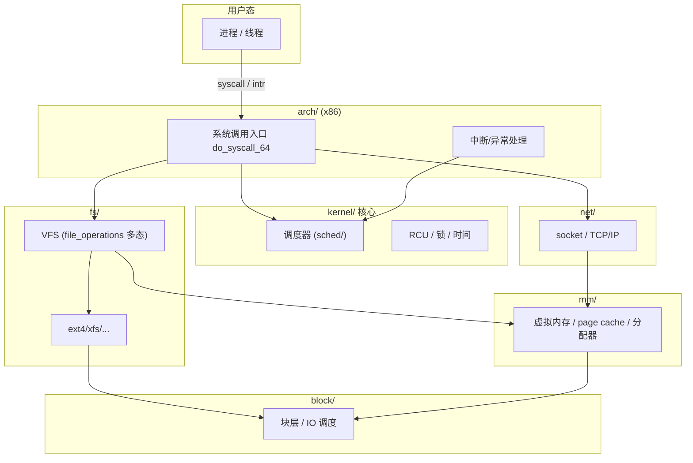
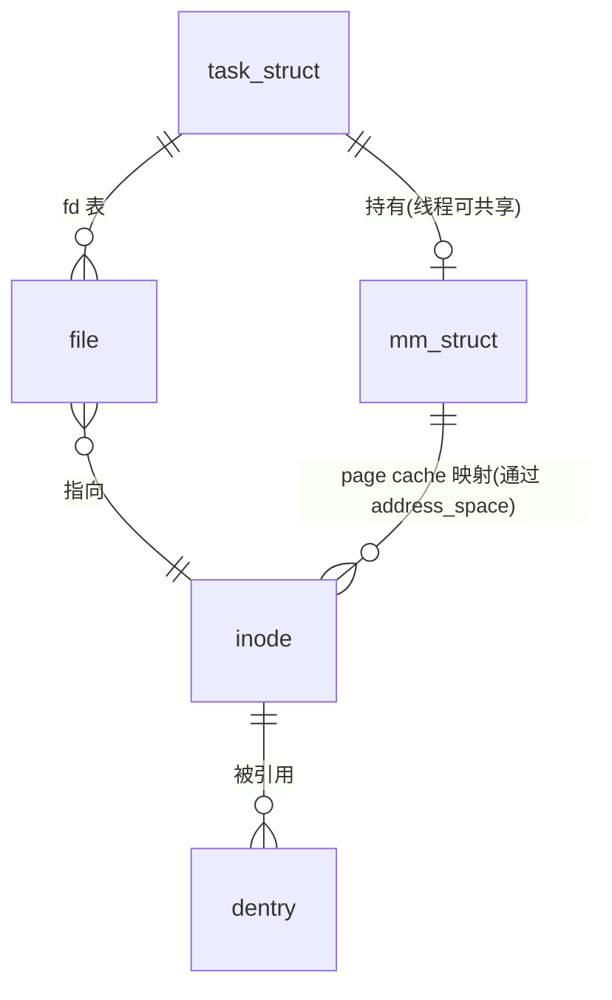
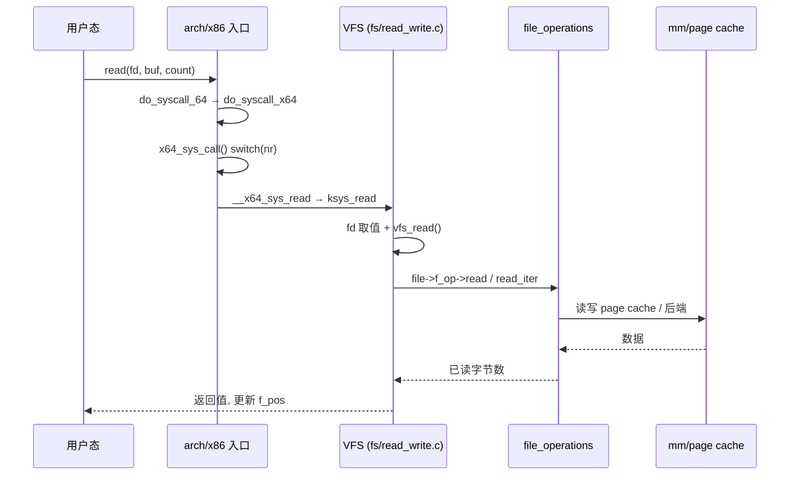

# Code Reading Report: Linux Kernel (linux-7.0.11 索引 / linux-7.1.2 源码)

> 按《代码搜索最佳实践》(`code_search_best_practices.md`) 执行。
> 结论标注：**[verified]** = 实跑/观测；**[static]** = 仅静态（含所有 code search 结果）。
> 探索路径：无具体问题 → 默认「整体架构 → 子模块」。

## 1. Scope & purpose

- **Purpose**：默认路径。先建 Linux 内核整体架构（子系统划分 + 分层），再下钻一条最有代表性的主线——**系统调用 `read(2)` 的完整路径**。
- **Environment**：**[static]** 未运行内核（无本地可跑 target，方法论允许并明示）。
  验证手段 = 语义搜索 + 源码阅读（源码树重映射，见下）。
- **索引环境（`$ACS check` 实测）**：
  - `linux_cache`：509,713 chunks，向量/HNSW 就绪（语义搜索可用），`call_graph.json` 存在，**`word_freq.json` 缺失**，KV 未导入。
  - ⚠️ **索引源码 `/opt/linux/src/linux-7.0.11` 已被删除**，现存 `linux-7.1.2` / `linux-7.2.3`。
    本报告读取时把路径前缀 `linux-7.0.11/` 重映射到 **`linux-7.1.2/`**（最接近），核心函数基本稳定。
  - ⚠️ `linux_712_cache` 有 1.47M chunks + call_graph，但**无向量**（语义搜索不可用）；重建向量成本约数小时，本次未做。
- **Out of scope**：`drivers/`（该索引不含）、`sound/`、`rust/`、各具体文件系统实现内部（ext4/btrfs…）、架构汇编细节。

## 2. Architecture overview（横向）  [static]

内核按 chunk 分布（`chunks_meta.jsonl` 统计）可见其"体量即架构"：

| 子系统 | chunks | 角色 |
|---|---:|---|
| `arch/` | 141,217 | 体系结构相关：系统调用入口、IRQ、MMU、启动 |
| `include/` | 78,907 | 头文件：核心数据结构与接口定义 |
| `fs/` | 74,433 | VFS + 各文件系统 |
| `net/` | 68,601 | 网络协议栈（socket/TCP/IP/…） |
| `kernel/` | 28,876 | 核心：调度、工作队列、时间、锁、RCU |
| `mm/` | 11,311 | 虚拟内存：页分配、页表、page cache、回收 |
| `lib/` | 10,486 | 通用库（rbtree/bitmap/atomic 等） |
| `security/` `crypto/` `block/` `io_uring/` `ipc/` … | 其余 | 安全/加密/块层/异步 IO/进程间通信 |

**分层读法**：`arch`(入口/硬件抽象) → `kernel`(核心服务) → `mm`/`fs`/`net`(三大功能域) → `block`(持久化)。
`drivers/` 是叶子（本索引未含）；`include/` 是横切（数据结构定义）。

## 3. Core data structures & relationships  [static]

| 结构 | 定义（linux-7.1.2） | 角色 | 关系 |
|---|---|---|---|
| `task_struct` | `include/linux/sched.h:820` | 进程/线程描述符 | 持有 `mm`、`files_struct`、调度实体；调度的基本单位 |
| `mm_struct` | `include/linux/mm_types.h:1172` | 地址空间 | 被 `task_struct` 持有；含 VMA 树、页表根；线程可共享 |
| `inode` | `include/linux/fs.h:767` | 文件元数据对象 | 磁盘对象的内存表示；被 `dentry` 引用 |
| `struct file` | `include/linux/fs.h:1260` | **打开的文件描述** | 指向 `inode` + `file_operations`；fd 表的一项 |
| `sk_buff` | `include/linux/skbuff.h:886` | 网络数据包 | 协议栈各层间传递 |

> 架构含义：**一切皆文件**由 `struct file` 里的 `const struct file_operations *f_op` 实现——
> 上层 VFS 只调 `f_op->read/read_iter`，具体文件系统/设备在背后多态实现。这是读 `fs/` 的钥匙。
> 进程 → 地址空间 → page cache → inode 的链条，串起了 `task_struct`/`mm_struct`/`inode`/`file` 四大结构。

## 4. Vertical analysis: `read(2)` 从用户态到文件系统  [static]

**关键位置（linux-7.1.2）**：
1. **入口**：`arch/x86/entry/syscall_64.c:87` `do_syscall_64` → `do_syscall_x64`（`:52`）→ `x64_sys_call`（`:35`）。
2. **分发**：`SYSCALL_DEFINE3(read,…)`（`fs/read_write.c`）→ `ksys_read`（`fs/read_write.c:706`）。
3. **VFS**：`vfs_read`（`fs/read_write.c:554`）做 `f_mode`/`access_ok`/`rw_verify_area` 校验后，
   分派到 `file->f_op->read`（旧式）或 `new_sync_read`（`fs/read_write.c:483`，走 `read_iter`）。
4. **落地**：具体文件系统的 `read_iter`（如 `filemap_read` → page cache → 缺页时回填 → `block/`）。

**横切**：这条链从 `arch`(入口) → `fs`(VFS) → `mm`(page cache) → `block`(IO)，正好验证了 §2 的分层。

## 5. Black boxes（有意不展开）

| 接口 | 输入 | 输出 | 作用 | 为何不开 |
|---|---|---|---|---|
| `file_operations.read_iter` | `kiocb`,`iov_iter` | 字节数 | 各 FS 的读实现 | 支线，按需再进 |
| `block/` bio 层 | bio | 完成 | 块设备 IO | 与读路径正交，另开 |
| `sound/`、`rust/` | — | — | 音频、Rust 支持 | 与核心架构无关 |
| 架构汇编 `entry_64.S` | — | — | 真正的入口指令 | 本次关注 C 层语义 |

## 6. Design commentary & open questions（Phase 8）

- **系统调用分发已从"跳转表"改为"switch"** **[static]**：`sys_call_table[]` 注释明说 *“no longer used for system calls”*，
  实际由 `x64_sys_call()` 的 `switch(include <asm/syscalls_64.h>)` 分发，并配合 `array_index_nospec()`。
  这是针对 **Spectre** 的缓解——避免数据相关的间接跳转/索引。经典读码材料里的 `sys_call_table[nr]` 已过时。
- **fd 生命周期用 cleanup（类 RAII）** **[static]**：`ksys_read` 里 `CLASS(fd_pos, f)(fd)` 自动管理 file 引用，
  取代了散落的手工 `fget`/`fput`。这是现代内核减少引用计数 bug 的方向。
- **VFS 多态**：`file_operations` 把"读/写/seek/mmap"抽象成函数指针表，是"一切皆文件"的机制核心；
  代价是间接调用 + cache 不友好，内核改用 `read_iter`/`iov_iter` 批量化。
- **我会怎么改/工具改进**：
  ① `call_graph.json` 被截断（3.4MB 处 `"argument`），说明写 JSON 未做转义/未原子写——大项目易损坏；
  ② 语义搜索对**结构体定义**很弱（搜 `task_struct` 返回的是 bpf 匿名嵌套结构、`omfs_inode` 等），
    精确结构名应回退到 **源码 grep**；`--kind struct` 过滤不足以救回排序；
  ③ `check` 应额外校验**索引记录的源码路径是否还存在**（本次 7.0.11 已删，check 未报警）。

## 7. Follow-ups

- [ ] 用修复后的 `call_graph` 重建 `linux_cache/call_graph.json`（当前损坏，`--callgraph` 不可用）。
- [ ] 补 `word_freq.json`（当前缺失，TF-IDF boost 关闭）→ 重跑 `vector` 的 Step 1。
- [ ] 若要语义搜索新内核：为 `linux_712_cache`(1.47M) 生成向量（成本高，建议分治）。
- [ ] 打开 `file_operations.read_iter` 黑盒：读 `mm/filemap.c:filemap_read` 的 page cache 路径。
- [ ] 对比跨项目：内核 IRQ/软中断 vs Nginx/Redis 事件循环（用户态）的处理模型差异。

---

### 附：本次方法论执行自评

| 阶段 | 是否执行 | 证据 |
|---|---|---|
| 1 跑起来 | ❌ 降级 | 无本地可跑内核；已在 §1 明示 |
| 2 明确目的 | ✅ | 无指令 → 默认整体架构→子模块 |
| 3 主线/支线 | ✅ | 选 read(2) 主线；列 4 个黑盒 |
| 4 纵横 | ✅ | 横向子系统图（带 chunk 量化）；纵向 read 链 sequence |
| 5 情景分析 | ❌ 降级 | 未运行；改用源码静态阅读（[static]） |
| 6 测试用例 | ❌ | 未用（内核测试需构建，超范围） |
| 7 数据结构 | ✅ | task_struct/mm_struct/inode/file/sk_buff 关系图 |
| 8 主动提问 | ✅ | spectre switch、CLASS(fd)、工具缺陷 3 条 |
| 9 报告 | ✅ | 本文件 |

**本次暴露的工具/环境问题（值得修）**：
1. 索引源码路径失效（7.0.11 删除）后，搜索结果指向不存在文件——`check` 应检测并报警。
2. `call_graph.json` 截断损坏（大项目 JSON 写未转义/非原子）。
3. 结构体语义搜索太弱，需明确"精确结构名用 grep"的降级策略。
4. `word_freq.json` 缺失导致 TF-IDF boost 静默失效——`check` 已能报出（本次确实报出）。
