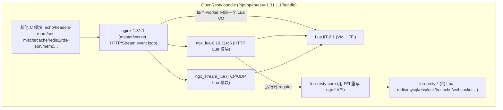
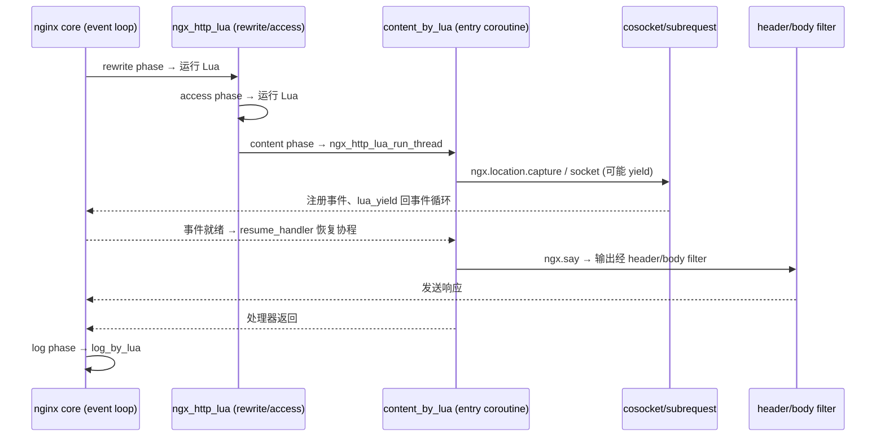

# Code Reading Report: OpenResty (nginx + ngx_lua bundle)

> 按《代码搜索最佳实践》(`code_search_best_practices.md`) 执行。
> 结论标注：**[verified]** = 实跑/日志观测；**[static]** = 仅静态（含所有 code search 结果）。
> 探索路径：无具体问题 → 默认「整体架构 → 子模块」。

## 1. Scope & purpose

- **Purpose**：默认路径。先建立 OpenResty 整体架构（bundle 组件关系），再下钻到最有价值的子模块——HTTP 请求的 Lua 处理链与 cosocket。
- **Environment**：**[verified]** 已本地跑通。源码 `/opt/openresty-1.31.1.1`，编译产物
  `/opt/openresty-1.31.1.1/build/nginx-1.31.1/objs/nginx`（`openresty/1.31.1.1`，内建 `ngx_lua-0.10.31rc5` + `ngx_stream_lua`）。
  以临时 prefix 启动于 `127.0.0.1:18080`，`content_by_lua_block` 返回成功。
  该二进制**未带 `--with-debug`**，故用 Lua `ngx.log` 打点替代 debug 日志（方法论允许的降级）。
- **索引环境**：`/opt/code_caches/openresty_cache`，35483 chunks，`.hnsw` 新于 `.bin`（验收通过）；
  KV Cache `/memory` **未**导入 openresty，故 `context/symbol` 走 KV 不可用，改用向量搜索 + 本地 `call_graph.json`/`dataflow.json`。
- **Out of scope**：各独立 C 模块内部（echo/redis2/rds-json/memc…）、`opm` 包管理、LuaJIT JIT 编译器内部、纯 Lua 库实现细节。

## 2. Architecture overview（横向）  [static]

OpenResty = **nginx 1.31.1 内核** + **LuaJIT** + **一组自研/第三方 nginx 模块**，打包成单一服务器。
核心价值在 `ngx_lua`：让 nginx 的每个请求处理阶段都能执行 Lua，并在 Lua 中做"看似阻塞、实则非阻塞"的网络 IO。



**组件层级（横向）**：
1. **nginx 内核**：master/worker 进程模型、HTTP 11 阶段处理管线、事件循环（epoll）。**[verified]**：实跑日志显示 `using the "epoll" event method`、`start worker process`。
2. **ngx_lua / ngx_stream_lua**：把 Lua 插入 HTTP / Stream 各阶段（`*_by_lua_block` / `*_by_lua_file`）。
3. **LuaJIT**：Lua VM，提供 FFI（直接调 C 函数）。
4. **lua-resty-core**：现代架构关键——把大部分 `ngx.*` API 用 FFI + 纯 Lua 重写（C 侧保留 183 个 `ngx_http_lua_ffi_*` 入口）[static]。由 `lua_load_resty_core` 指令控制加载（默认开）。
5. **lua-resty-\***：纯 Lua 客户端库（redis/mysql/dns/lock/…），都建立在 cosocket 之上。

## 3. Core data structures & relationships  [static]

| 结构 | 定义 | 创建者 | 持有者 | 角色 |
|---|---|---|---|---|
| `ngx_cycle_t` | nginx core | `ngx_init_cycle()` | 全局 `ngx_cycle` | 全部配置/模块/连接池的运行期快照；reload 时整体替换 |
| `ngx_http_request_t` | nginx http | `ngx_http_alloc_request` | 每个请求 | 请求全生命周期状态 |
| `ngx_http_lua_ctx_t` | `ngx_http_lua_common.h:628` | `ngx_http_lua_create_ctx` | 请求（经 Lua registry 的 `ctx_ref` 锚定） | **Lua 侧的请求上下文**：`request`、`entry_co_ctx`、`user_co_ctx`、`cur_co_ctx`、`downstream`、`posted_threads`、阶段标志位 |
| `ngx_http_lua_co_ctx_t` | `ngx_http_lua_common.h` | `ngx_http_lua_new_thread` | `ctx`（入口协程 + `user_co_ctx` 列表） | **每个 Lua 协程一个**，保存该协程的 `lua_State *` 与挂起点 |
| cosocket 对象 | `ngx_http_lua_socket_tcp.c` | `ngx_http_lua_socket_tcp_connect_helper` | Lua 用户数据 / `ctx->downstream` | 非阻塞 TCP/UDP 连接状态 |

```mermaid
erDiagram
    ngx_cycle_t ||--o{ ngx_http_lua_ctx_t : "请求期"
    ngx_http_request_t ||--|| ngx_http_lua_ctx_t : has (ctx_ref)
    ngx_http_lua_ctx_t ||--|| ngx_http_lua_co_ctx_t : entry_co_ctx
    ngx_http_lua_ctx_t ||--o{ ngx_http_lua_co_ctx_t : user_co_ctx
    ngx_http_lua_ctx_t ||--o| Cosocket : downstream
```

> 架构含义：**请求上下文 (`ctx`) 与协程上下文 (`co_ctx`) 分离**是理解 ngx_lua 的钥匙——
> 一个请求可以有多个 Lua"用户协程"（`ngx.thread.spawn`），协程被挂起时 `ctx` 仍在，靠 `cur_co_ctx` 切换。

## 4. Vertical analysis: 一次 HTTP 请求的 Lua 处理链  [verified]

**入口链 [static]**：master `ngx_master_process_cycle` → `ngx_start_worker_processes` → worker `ngx_worker_process_init`
→ 遍历模块调 `init_process` → `ngx_http_lua_init_worker`（建 worker 级 Lua VM）
→ 请求到达后 nginx 按阶段调用 ngx_lua 注册的 handler（`ngx_http_lua_rewrite/access/content/log_handler`）。

**观测路径 [verified]**——在配置中给每个阶段加 `ngx.log` 打点，真实顺序如下：

```
[1] rewrite_by_lua
[2] access_by_lua
[3] content_by_lua begin
[3b] subrequest status=200 body=SUBREQ      ← ngx.location.capture("/internal")
[4] header_filter_by_lua
[5] body_filter_by_lua
[3c] content_by_lua end                      ← ngx.say 已把输出推入 filter 链，之后处理器才返回
[5] body_filter_by_lua                        ← body filter 按 chunk 多次触发
[6] log_by_lua
```



**关键机制：cosocket 的"同步写法、异步执行" [static]**
`ngx.socket.tcp():connect()` 经 lua-resty-core(FFI) 进入 `ngx_http_lua_socket_tcp_connect_helper`
（`ngx_http_lua_socket_tcp.c:586`）。若连接不能立即完成，它注册可写事件、`lua_yield` 挂起当前协程并
返回 nginx 事件循环；socket 就绪时事件处理器调用 `resume_handler` 恢复协程。于是 Lua 代码里"一行阻塞调用"
在底层被拆成 yield/resume，**不阻塞 worker**。这就是 OpenResty 相对回调式异步的核心体验优势。

> 观察点 **[verified]**：`header_filter`/`body_filter` 在 `content_by_lua end` **之前**就出现了——
> 因为 `ngx.say` 会立即把数据推入输出 filter 链，说明 content 处理器的"输出"与"函数返回"不是同一时刻。

## 5. Black boxes（有意不展开）

| 接口 | 输入 | 输出 | 作用 | 为何不开（支线） |
|---|---|---|---|---|
| LuaJIT JIT/FFI | Lua/字节码 | 机器码/C 调用 | 执行加速 | 与"请求链路"目的无关 |
| `lua-resty-redis/mysql/dns/lock` 等 | 连接参数/命令 | 响应对象 | 具体协议客户端 | 都建立在 cosocket 之上，属支线 |
| 各 C 模块（echo/redis2/rds-json…） | nginx 指令 | filter/handler | 各自小功能 | 与主链正交 |
| `opm` | 包名 | 安装 | 包管理 | 非运行时 |
| `ngx_http_lua_shdict` | key/value | 共享值 | 跨 worker 共享字典 | 独立子模块，另开 |

## 6. Design commentary & open questions（Phase 8）

- **为何用协程而非回调**：cosocket 把异步事件循环包装成同步 Lua，代码可读性和可维护性大幅提升；
  代价是每个并发请求要保存一个协程栈（`co_ctx`），内存换开发效率。**对照 `[static]`**：`cross-search`/定向搜索显示
  Redis 用 `aeCreateFileEvent` + `connSocketEventHandler`（`/opt/redis/src/ae.c:145`, `src/socket.c:247`）走回调式，
  LuaJIT 用 `lua_resume`（`src/lj_api.c:1229`）做栈切换——OpenResty 正是把两者拼起来。
- **为何把 API 迁到 lua-resty-core（FFI+Lua）**：C 侧从"上千行 API 实现"缩减为 183 个 FFI 入口 [static]，
  功能迭代在 Lua 层完成，发布更快；代价是多一层间接、调试跨越 C/Lua 边界。
- **我会怎么改/工具改进**：本次 `call_graph.json` 的"高扇入主线"被 **LuaJIT 宏和误报符号**污染
  （`LJLIB_CF` 167、`asm_ir` 60、`dd`、`lua_*` 等），对 Lua/C 混合项目，调用图需按文件/前缀过滤后再判主线。
  这属于索引器对"宏当函数调用解析"的已知噪声（对应 `coding.md` 踩坑记录）。
- **可疑点**：无重大异常；但要注意 `dataflow.json` 含 `void` 等非变量噪声键，字段级查询前应过滤。

## 7. Follow-ups

- [ ] 打开 `ngx_http_lua_shdict` 黑盒：跨 worker 共享字典的 shm/锁实现。
- [ ] 用带 `--with-debug` 的构建重跑，拿 nginx 原生 debug 日志（当前靠 Lua 打点）。
- [ ] 读 `ngx_http_lua_run_thread`（`ngx_http_lua_util.c:1120`）源码，验证协程调度与 `posted_threads` 语义。
- [ ] 验证 `ngx.thread.spawn` 多用户协程与 `ctx->user_co_ctx` 的对应关系。
- [ ] 跨项目深挖：把 `lua-resty-lock`（cosocket+shdict）与 Redis 分布式锁实现做对比。

---

### 附：本次方法论执行自评

| 阶段 | 是否执行 | 证据 |
|---|---|---|
| 1 跑起来 | ✅ [verified] | 启动 built nginx + `content_by_lua` 成功 |
| 2 明确目的 | ✅ | 无指令 → 默认整体架构→子模块 |
| 3 主线/支线 | ✅ | 高扇入 + 调用链判主线；列出 5 个黑盒 |
| 4 纵横 | ✅ | 横向组件图；纵向请求链 sequence |
| 5 情景分析 | ✅ [verified] | 临时打点日志得到真实 phase 顺序 |
| 6 测试用例 | ⚠️ 部分 | 用自建最小配置替代项目自带测试 |
| 7 数据结构 | ✅ [static] | `ctx`/`co_ctx`/`request`/`cycle` 关系图 |
| 8 主动提问 | ✅ | 协程 vs 回调、FFI 迁移、调用图噪声 |
| 9 报告 | ✅ | 本文件 |

**方法论短板暴露**：`context/symbol` 依赖 `/memory` KV 导入，而 openresty 未导入 → 走了向量搜索 + 本地 JSON 的降级路径。
建议：探索前先确认目标项目已 `cache_import` 到 `/memory`，否则 Phase 3/7 的"单函数完整角色"能力不可用。
