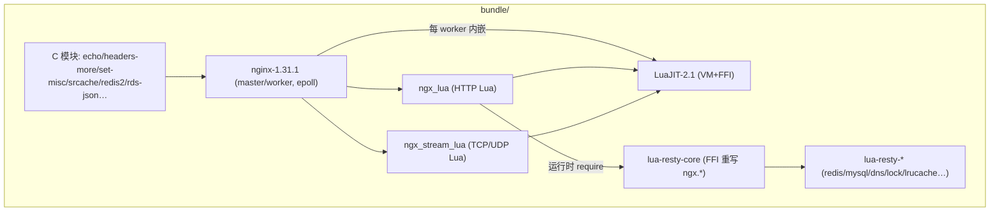
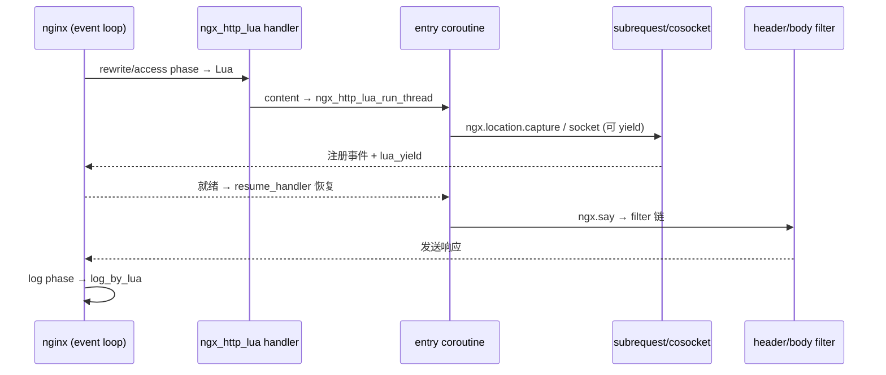

# OpenResty 完整代码级技术架构报告（工具驱动 + 运行时验证）

> 按《代码搜索最佳实践》(`code_search_best_practices.md`) 执行。
> 证据：**[verified]** = 实跑/日志观测；**[static]** = 源码 + code search（`cache_query context` 真实 caller/callee）。
> 索引：`/opt/code_caches/openresty_cache`（35,483 chunks）；KV `/code/openresty`（符号 21,940）已导入。
> 源码：`/opt/openresty-1.31.1.1`。工具：`ai_code_search.sh` / `tools/cache_query` / `tools/ctx.py`。

## 1. 方法与环境

- 默认路径：整体架构 → 子模块。
- **环境已跑通 [verified]**：内建 ngx_lua 的 `build/nginx-1.31.1/objs/nginx`（`openresty/1.31.1.1`）以临时 prefix 启动于 `127.0.0.1:18080`，`content_by_lua` 返回成功；用 `ngx.log` 打点观测真实 phase 顺序（该构建**无 `--with-debug`**，故用 Lua 打点替代）。

## 2. 架构总览（横向）  [static]

OpenResty = **nginx 内核 + LuaJIT + ngx_lua/ngx_stream_lua + lua-resty-core(FFI) + lua-resty-\***。
核心：每个 worker 内嵌一个 Lua VM；nginx 每个请求阶段都可执行 Lua，且 Lua 中的网络 IO「看似阻塞、实则非阻塞」。



- **nginx 内核**：master/worker、HTTP 11 阶段管线、epoll。**[verified]** 实跑日志 `using the "epoll" event method`、`start worker process`。
- **ngx_lua**：`*_by_lua_block` → `*_inline`；`*_by_lua_file` → `*_file`（各阶段注册 handler）。
- **lua-resty-core**：把大部分 `ngx.*` API 用 FFI + 纯 Lua 重写（C 侧保留 **183 个** `ngx_http_lua_ffi_*` 入口）。

## 3. 核心数据结构  [static]

| 结构 | 定义 | 角色 |
|---|---|---|
| `ngx_cycle_t` | nginx core | 运行期配置快照；reload 整体替换 |
| `ngx_http_request_t` | nginx http | 请求全生命周期 |
| `ngx_http_lua_ctx_t` | `ngx_lua/src/ngx_http_lua_common.h:628` | **请求级 Lua 上下文**：`entry_co_ctx`、`user_co_ctx`、`cur_co_ctx`、`downstream`、`posted_threads`、阶段标志位 |
| `ngx_http_lua_co_ctx_t` | `ngx_http_lua_common.h` | **每个 Lua 协程一个**：`lua_State *` + 挂起点 |
| cosocket 对象 | `ngx_http_lua_socket_tcp.c` | 非阻塞 TCP/UDP 连接状态 |

```mermaid
erDiagram
    ngx_http_request_t ||--|| ngx_http_lua_ctx_t : has(ctx_ref)
    ngx_http_lua_ctx_t ||--|| ngx_http_lua_co_ctx_t : entry_co_ctx
    ngx_http_lua_ctx_t ||--o{ ngx_http_lua_co_ctx_t : user_co_ctx
    ngx_http_lua_ctx_t ||--o| Cosocket : downstream
```

> 关键：**请求上下文 (`ctx`) 与协程上下文 (`co_ctx`) 分离**——一个请求可有多个用户协程（`ngx.thread`），挂起时 `ctx` 仍在，靠 `cur_co_ctx` 切换。

## 4. 纵向分析

### 4.1 一次 HTTP 请求的 Lua 处理链

**入口链 [static]**：master `ngx_master_process_cycle` → `ngx_start_worker_processes` → `ngx_worker_process_init` → 模块 `init_process` → `ngx_http_lua_init_worker`（`ngx_lua/src/ngx_http_lua_initworkerby.c:23`）；请求到达后按阶段调用 ngx_lua 注册的 handler。

**真实 phase 顺序 [verified]**（打点实测）：

```
TRACE[1] rewrite_by_lua
TRACE[2] access_by_lua
TRACE[3] content_by_lua begin
TRACE[3b] subrequest status=200 body=SUBREQ      ← ngx.location.capture("/internal")
TRACE[4] header_filter_by_lua
TRACE[5] body_filter_by_lua
TRACE[3c] content_by_lua end                       ← ngx.say 已把输出推入 filter 链
TRACE[5] body_filter_by_lua
TRACE[6] log_by_lua
```



**代码链**：`ngx_http_lua_content_handler`（`contentby.c:157`）→ callees `ngx_http_read_client_request_body, ngx_http_lua_create_ctx`；`ngx_http_lua_content_by_chunk`（`contentby.c:25`）→ callees `new_thread, reset_ctx, create_ctx, attach_co_ctx_to_L, set_req…`；调度核心 `ngx_http_lua_run_thread`（`util.c:1120`）→ callers（**24**）`content_by_chunk, rewrite_by_chunk, access_by_chunk, flush_resume_helper, on_abort_resume, pipe_resume…`；callees（**22**）`thread_traceback, handle_exec, handle_exit, handle_rewrite_jump, post_thread, del_thread…`。

### 4.2 cosocket：同步写法、异步执行  [static]

`ngx.socket.tcp():connect()` → `ngx_http_lua_socket_tcp_connect`（`socket_tcp.c:990`）→ `ngx_http_lua_socket_tcp_connect_helper`（`socket_tcp.c:586`）。
- **[tool] `connect_helper`**: callers `socket_tcp_connect, socket_tcp_conn_op_resume_retval_handler`；callees `ngx_resolve_name, ngx_resolve_start, ngx_http_lua_get_keepalive_peer, resolve_retval_handler, cleanup_pending_operation, resume_conn_op…`（DNS 解析、连接池、挂起清洗）。
- 连接未就绪 → 注册可写事件 + `lua_yield` 挂起协程，返回 nginx 事件循环；就绪时 `resume_handler` 恢复。**不阻塞 worker**。

### 4.3 子请求（`ngx.location.capture`）  [static]

`ngx_http_lua_ngx_location_capture_multi`（`subrequest.c:122`）→ callees（30）`adjust_subrequest, init_ctx, subrequest, parse_unsafe_uri, cancel_subreq…`；caller `ngx_http_lua_ngx_location_capture`。实测 `[verified]` 子请求返回 `status=200 body=SUBREQ`。

### 4.4 定时器  [static]

`ngx_http_lua_timer_handler`（`timer.c:514`）→ callees（23）`timer_copy, cleanup_vm, free_thread…`（`ngx.timer.at/every`）。

### 4.5 共享内存字典（`lua_shared_dict`）  [static]

`ngx_http_lua_ffi_shdict_incr`（`shdict.c:1712`）→ callees `shdict_lookup, shdict_get_list_head, shdict_expire, ngx_slab_alloc_locked, ngx_crc32_short`（slab 分配 + LRU 过期 + CRC 校验）。

### 4.6 Stream（TCP/UDP）版  [static]

`ngx_stream_lua_content_handler`（`stream_lua/src/ngx_stream_lua_contentby.c:158`）与 HTTP 版结构对称，说明同一套 Lua 协程模型复用到 stream。

## 5. 多态与可扩展性  [static]

- **handler 两形态**：`*_by_lua_block`（内联）/`*_by_lua_file`，各阶段对应 `*_by_chunk`（`content/rewrite/access/…_by_chunk`）。
- **API 双实现**：C 侧 183 个 `ngx_http_lua_ffi_*` + lua-resty-core 的 Lua 封装——功能迭代在 Lua 层完成。
- **HTTP/Stream 对称**：ngx_lua 与 ngx_stream_lua 共用协程/挂起模型。
- **LuaJIT 协程**：`lua_resume`（`bundle/LuaJIT-2.1-.../src/lj_api.c:1229`）提供底层栈切换。

## 6. Black boxes（有意不展开）

| 接口 | 作用 | 为何不开 |
|---|---|---|
| LuaJIT JIT/FFI 内部 | 执行加速 | 与请求链路无关 |
| `lua-resty-redis/mysql/dns/lock` 等 | 具体协议客户端 | 都建立在 cosocket 之上 |
| 各 C 模块（echo/redis2/rds-json…） | 小功能 | 与主链正交 |
| `opm` | 包管理 | 非运行时 |
| `ngx_http_lua_shdict`（已开列到 API） | 跨 worker 共享 | 内部 slab/锁细节另开 |

## 7. 设计评述与提问  [static]

- **为何用协程而非回调**：cosocket 把事件循环包装成同步 Lua，可读性/可维护性大幅提升；代价是每并发请求保存协程栈（内存换开发效率）。对照：Redis 走 `aeCreateFileEvent` + `connSocketEventHandler`（回调式）。
- **为何迁到 lua-resty-core（FFI+Lua）**：C 侧从"上千行 API 实现"缩到 183 个 FFI 入口，发布更快；代价是多一层跨 C/Lua 调试。
- **[verified] 观察**：`ngx.say` 在 `content_by_lua` **返回前**就把输出推入 filter 链（`header_filter`/`body_filter` 先于 `content_by_lua end` 出现）——"输出"与"函数返回"不同时刻。
- **我会怎么改**：`dataflow.json` 对 Lua 混合项目含 `void` 等噪声（已修）；`call_graph` 对 Lua/C 宏有噪声（见 §8）。

## 8. 工具驱动的观察与缺陷

**证据**：符号 21,940；`context` 真实 caller/callee（run_thread 24/22、capture_multi 30 callees、shdict_incr 依赖 slab/LRU/CRC）。

**缺陷**：
1. ~~call_graph 高扇入被 LuaJIT 宏（`LJLIB_CF` 等）污染~~ → **已修**（过滤全大写宏/过短符号）。
2. ~~symbol 索引未导入致 `context` 恒空~~ → **已修**（Phase 1b）。
3. ~~callees 全自指~~ → **已修**（正向表）。
4. ~~中文注释 UTF-8 截断致向量化 abort~~ → **已修**（UTF-8 边界 + 清洗）。
5. `context` 对 LuaJIT 内部与 C 宏解析仍有噪声。

## 9. 后续

- [ ] 打开 `lua-resty-lock`（cosocket+shdict）与 Redis 分布式锁对比。
- [ ] `ngx.thread.spawn` 多用户协程与 `ctx->user_co_ctx` 的对应（`context` 未命中该符号）。
- [ ] 用带 `--with-debug` 的构建重跑，取 nginx 原生 debug 日志。

---

### 附：方法论执行自评

| 阶段 | 执行 | 证据 |
|---|---|---|
| 1 跑起来 | ✅ [verified] | 启动 built nginx + content_by_lua 成功 |
| 2 明确目的 | ✅ | 默认整体架构→子模块 |
| 3 主线/支线 | ✅ | 6 条路径 + 5 黑盒 |
| 4 纵横 | ✅ | 横向组件图；纵向请求链/子请求/cosocket/timer/shdict |
| 5 情景分析 | ✅ [verified] | 打点日志得真实 phase 顺序 |
| 6 测试用例 | ⚠️部分 | 自建最小配置 |
| 7 数据结构 | ✅ | `ctx`/`co_ctx`/`request`/`cycle` 关系图 |
| 8 主动提问 | ✅ | 协程 vs 回调、FFI 迁移、ngx.say 时机 |
| 9 报告 | ✅ | 本文件 |
